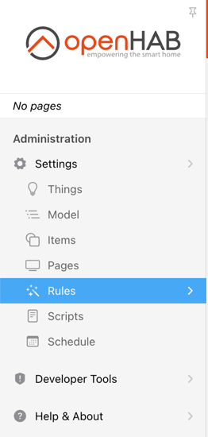
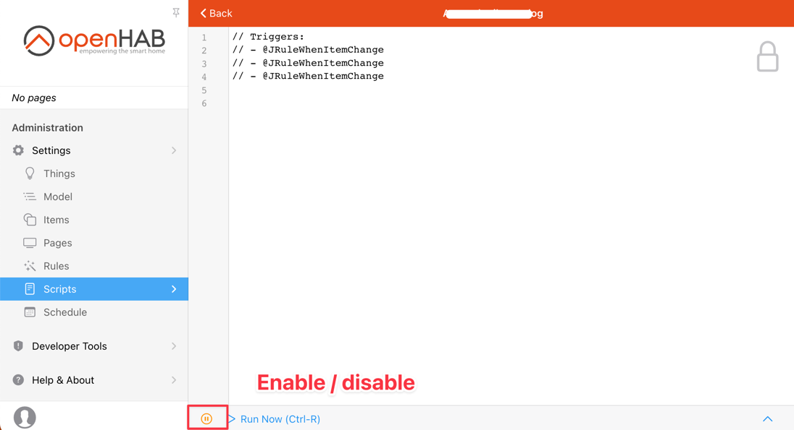

# openHAB Rules using Java

The JRule Automation Addon enables openHAB rule development using plain old Java. It can considered a replacement or an
addition to other rule languages like openHAB DSL, Javascript and others.

Rules may be provided as Java source files directly (compiled on server) or as precompiled jar files (compiled on
developer machine - like any other regular Java project - **recommended**).

### Latest release

* [](https://github.com/seaside1/jrule/releases/latest)
* [Full changelog](doc/CHANGELOG.md)

## Table of contents

- [openHAB Rules using Java](#openhab-rules-using-java)
    + [Latest release](#latest-release)

    * [Why](#why)
    * [Target audience](#target-audience)
    * [Maturity](#maturity)
    * [Limitations](#limitations)
- [Getting started](#getting-started)
    * [Example rule file](#example-rule-file)
- [How it works](#how-it-works)
    + [Third Party External Dependencies](#third-party-external-dependencies)
    + [Configuration file](#configuration-file)
- [Rule constructs](#rule-constructs)
    * [Rule annotations](#rule-annotations)
        + [Triggers](#triggers)
        + [Pre-conditions](#pre-conditions)
        + [Logging](#logging)
        + [Other annotations](#other-annotations)
    * [Generated code](#generated-code)
        + [JRuleItems and JRuleItemNames](#jruleitems-and-jruleitemnames)
        + [JRuleThings](#jrulethings)
        + [JRuleThingActions](#jrulethingactions)
    * [Other built-in actions](#other-built-in-actions)
- [GUI support](#gui-support)
- [Examples](#examples)

## Why

- You will be able to use a standard Java IDE to develop your rules.
- Full auto-completion (Shift space) in your IDE for all items, things and actions yields less chance of errors and
  typos
- Take full advantage of all Java design patterns
- Share and reuse code for you rules
- Advanced timers and locks are built in and can be used without cluttering the code
- Possibility to write junit-tests to test your rules
- Use any 3rd party dependencies and libraries in your rules
- You will be able to use JRule in parallel with any other Rules engine if you want to give it a try
- Compile and build your rules with tools such as maven, or provide rules in plain Java files
- Utilize thing actions and trigger on thing statuses
- Reuse you methods and code for many different purposes, reducing the amount of code you have to write.
- Advanced logging can be used with for instance logstash using MDC-tags

## Target audience

This addon is not for beginners, you should have knowledge in writing Java programs or a desire to do so.
As you can see in the examples below, rules will become short and readable making it easy to understand once you learn
how to write the rules.

## Maturity

Beta, still major changes.

## Limitations

- Not supporting OH3 GUI rules

# Getting started

1. Install the addon by either

- copying the `org.openhab.automation.jrule-4.x.x-BETAX.jar`
  from https://github.com/seaside1/jrule/releases to openhab-addons folder
- or by installing form openHAB Addon Marketplace.

2. Create rules by either

- clone https://github.com/seaside1/jrule-user and use as a template rule project.
- or provide Java source files directly in the `/etc/automation/jrule/rules/org/openhab/automation/jrule/rules/user/` on
  your openHAB installation.

## Example rule file

> Note: All rule classes must extend `org.openhab.automation.jrule.rules.JRule`

`default.items`:

```
Switch MyTestSwitch  "Test Switch"
```

`MySwitchRule.java`:

```java
package org.openhab.automation.jrule.rules.user;

import org.openhab.automation.jrule.rules.JRule;
import org.openhab.automation.jrule.rules.JRuleName;

import static org.openhab.automation.jrule.rules.value.JRuleOnOffValue.OFF;
import static org.openhab.automation.jrule.rules.value.JRuleOnOffValue.ON;

import static org.openhab.automation.jrule.generated.items.JRuleItemNames.MyTestSwitch;

public class MySwitchRule extends JRule {
    @JRuleName("MySwitchRule")
    @JRuleWhenItemChange(item = MyTestSwitch, from = OFF, to = ON)
    public void execOffToOnRule() {
        logInfo("||||| --> Hello World!");
    }

}
```

See also [extensive list of examples](doc/EXAMPLES.md).

# How it works

_Assuming_ you are running a plain Linux setup like openHABian, the `$JRULE_ROOT` would
equal `/etc/openhab/automation/jrule` in the following table:

| Location                              | Description                                                                             |
|---------------------------------------|-----------------------------------------------------------------------------------------|
| `$JRULE_ROOT/gen/`                    | Generated source files containing all items, things and actions                         |
| `$JRULE_ROOT/jar/jrule-generated.jar` | Jar file of the generated files (`$JRULE_ROOT/gen/`) - used for rule development        |
| `$JRULE_ROOT/jar/jrule.jar`           | JRule Addon classes (reference to openHAB core classes etc) - used for rule development |
| `$JRULE_ROOT/jrule.conf`              | Configuration file (optional), see below                                                |
| `$JRULE_ROOT/ext-lib/`                | Optional 3rd party dependencies (may also be shaded in a compiled rule jar)             |
| `$JRULE_ROOT/rules/`                  | Java rule source files that will be compiled by openhab (optional)                      |
| `$JRULE_ROOT/rules-jar/`              | Any jar files placed here will be loaded as precompiled rule classes                    |

* When the addon starts _or_ there is a change in items/things on your openHAB
  instance, `$JRULE_ROOT/jar/jrule-generated.jar` and `$JRULE_ROOT/jar/jrule.jar` are updated, and all rules recompiled
  and reloaded.
* When a Java source file with rules in `$JRULE_ROOT/rules/` is updated, the rule is compiled and reloaded.
* When a jar file in `$JRULE_ROOT/rules-jar/` is updated, all rules are reloaded.

### Example scripts to easily handle the copy process

#### Grab the jrule engine from the server

```shell
scp <user>@<oh-server>:$JRULE_ROOT/jar/jrule.jar lib/jrule.jar
```

#### Grab the generated jrule source

```shell
scp <user>@<oh-server>:$JRULE_ROOT/jar/jrule-generated.jar lib/jrule-generated.jar
```

#### Grab the generated jrule source

```shell
scp target/openhab-rules-1.0-SNAPSHOT.jar <user>@<oh-server>:$JRULE_ROOT/rules-jar/openhab-rules-1.0-SNAPSHOT.jar
```

### Third Party External Dependencies

You can add any 3rd party library as dependency. Copy the jar files needed to `$JRULE_ROOT/ext-lib/`
The Automation Engine will automatically pick these dependencies up when it is compiling and reloading the rules.

### Configuration file

JRule has some optional configuration properties. Add file `$JRULE_ROOT/jrule.conf`

Example:

```properties
## Run rules in a separate threadpool
org.openhab.automation.jrule.engine.executors.enable=false
## Minimum number of threads
org.openhab.automation.jrule.engine.executors.min=2
## Maximum number of threads
org.openhab.automation.jrule.engine.executors.max=10
```

# Rule constructs

Multiple annotations are available to configure triggers etc. See [extensive list of examples](doc/EXAMPLES.md).

All rules must inherit from `org.openhab.automation.jrule.rules.JRule` which provides easy access to a set of useful
methods.

## Rule annotations

All rule methods _must_ be annotated with `@JRuleName`, or the method will _not_ be considered.

### Triggers

Triggers are necessary to cause rule method invocations. The following triggers are available:

| Annotation                      | Description                                                                          |
|---------------------------------|--------------------------------------------------------------------------------------|
| `@JRuleWhenItemChange`          | Trigger rule if item state changes                                                   |
| `@JRuleWhenItemReceivedCommand` | Trigger rule if item receives a command                                              |
| `@JRuleWhenItemReceivedUpdate`  | Trigger rule if item receives an update                                              |
| `@JRuleWhenThingTrigger`        | Trigger rule if thing status changes                                                 |
| `@JRuleWhenChannelTrigger`      | Trigger rule if thing channel triggers                                               |
| `@JRuleWhenCronTrigger`         | Trigger rule if cron expression matches current time                                 |
| `@JRuleWhenTimeTrigger`         | Trigger rule if hour/minute/second matches current time (simplified cron expression) |

### Pre-conditions

Preconditions are conditions that must be met in order to execute a rule method.

Multiple `@JRulePreCondition` annotations may be added to each method. All conditions must be satisified for rule method
to be executed.

`@JRulePrecondition( item = JRuleItemNames.MyItemName, condition = @JRuleCondition( OPERATOR = VALUE ) )`

Supported `OPERATOR` values:

| `OPERATOR` | Description         |
|------------|---------------------|
| `eq`       | Equals              |
| `neq`      | Not Equals          |
| `gt`       | Greater than        |
| `gte`      | Greater than equals |
| `lt`       | Less than           |
| `lte`      | Less than equals    |

whereby gt, gte, lt, lte just working with numeric Items

### Logging

* A rule may log any activity to a separate logger if `@JRuleLogName` is added.
* Provide additional MDC tags by providing a `@JRuleTag`.

Logging from rule can be done in 3 different ways

1. Not specifying anything will result in the usage of JRuleName as prefix when calling JRule.logInfo/Debug/Error etc.
   See Example 20
2. Overriding method JRule.getRuleLogName will result in the same log prefix for all rules defined in that file. See
   Example 21
3. Specifically add dependency on log4j and define your own logger to do logging

### Other annotations

| Annotation       | Description                                             |
|------------------|---------------------------------------------------------|
| `@JRuleDelayed`  | Delay rule method invocation by a given amount of time  |
| `@JRuleDebounce` | Limit rule execution to once every given amount of time |

## Generated code

### JRuleItems and JRuleItemNames

* `org.openhab.automation.jrule.generated.items.JRuleItems` contains a field for each `Item`. You can send
  commands/updates and access state/label/metadata
* `org.openhab.automation.jrule.generated.items.JRuleItemNames` contains an `Item` name field for each item for item
  name safety in annotations etc.

### JRuleThings

* `org.openhab.automation.jrule.generated.things.JRuleThings` contains a field for each `Thing`. On a `Thing` may get
  status, any bridge (if present) or child things (if it is a bridge)

### JRuleThingActions

* `org.openhab.automation.jrule.generated.things` package contains a class for each `Thing` that support thing-specific
  actions

See example #34

## Other built-in actions

These are method inherited from the JRule superclass.

| Action                               | Description                                                             |
|--------------------------------------|-------------------------------------------------------------------------|
| `say`                                | Will use VoiceManager to synthesize voice. See Example 13               |
| `executeCommandLine`                 | Execute a command line program (fire and forget) See Example 14         |
| `executeCommandLineAndAwaitResponse` | Execute a command line program (wait for response) See Example 14       |
| `transform`                          | Perform a value transformation using openHAB tranformation services     |
| `sendHttpXXXRequest`                 | Call HTTP endpoint using GET/POST/PUT/DELETE method                     |
| `createTimer`                        | Schedule a future callback                                              |
| `createOrReplaceTimer`               | Schedule a future callback, cancel existing callback if exists          |
| `createRepeatingTimer`               | Schedule repeating future callbacks                                     |
| `createOrReplaceRepeatingTimer`      | Schedule repeating future callbacks, cancel existing callback if exists |
| `cancelTimer`                        | Cancel an existing future callback                                      |
| `isTimerRunning`                     | Check if existing future callback exist                                 |
| `getTimedLock`                       | Create a lock to be held for a certain amount of time                   |
| `sendCommand`                        | Send a command to an item                                               |
| `postUpdate`                         | Post a state update to an item                                          |
| `logXXX`                             | Log a Debug/Info/Warn/Error message                                     |

## GUI support

Rules are registered in the rule registry:



Rules can be **disabled** and **re-enabled** runtime, and this will persist across restarts as this is managed by
openHAB.



> There is *no* support for neither writing nor executing rules directly from the GUI.

# Examples

[Examples can be found here](doc/EXAMPLES.md)

